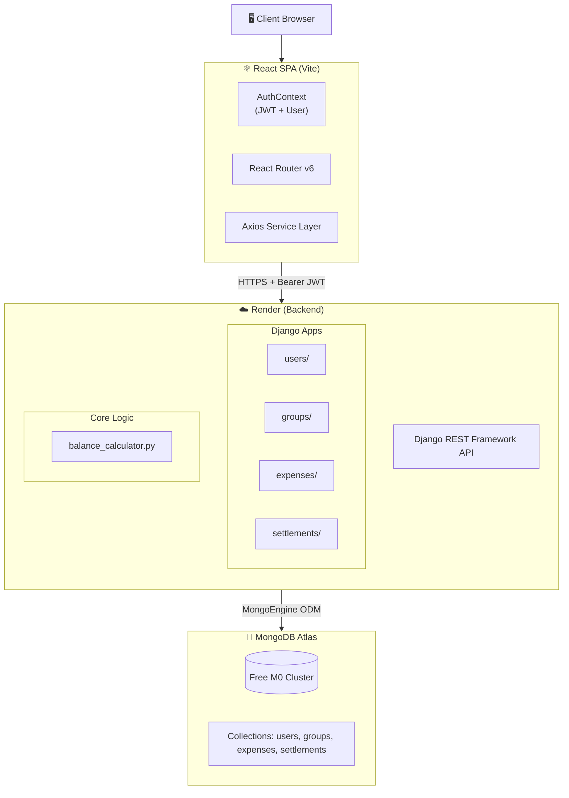
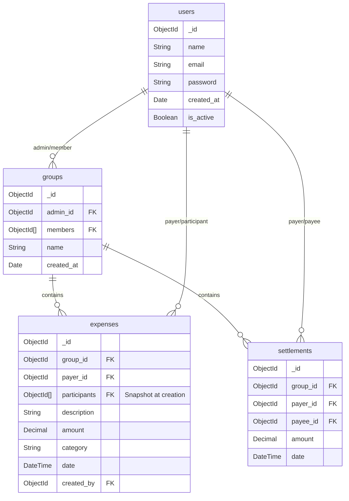
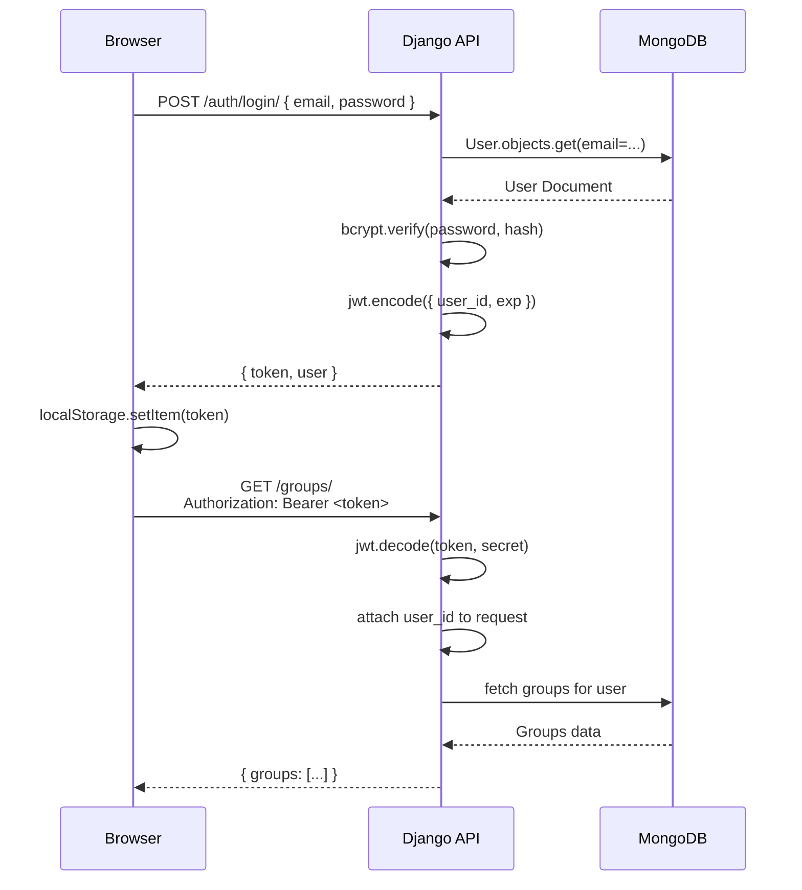
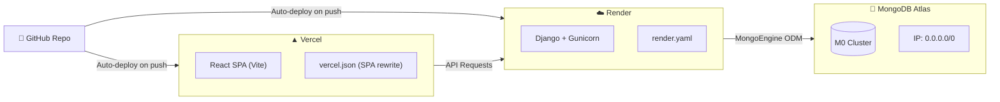

# 💸 Splitwise

> A full-stack, production-ready expense-splitting web application — built as an internship evaluation project in 3 focused days. Clones the core UX and business logic of Splitwise with a clean, modern design using React, Django REST Framework, and MongoDB Atlas.

<div align="center">

**[Live Demo](https://splitwise-six-kappa.vercel.app/)** · **[API Base URL](https://splitwise-r3oa.onrender.com/)** · [AI_CONTEXT.md](./AI_CONTEXT.md) · [BUILD_PLAN.md](./BUILD_PLAN.md)

</div>

---


## 🏗️ System Architecture



---

## 🗃️ Data Model



> **Key design decision:** `expense.participants` is a **snapshot** of group members at creation time. This means members who leave the group are still correctly accounted for in historical splits.

---

## ⚖️ Balance Calculation Algorithm

Balances are **never stored in the database** — they are recomputed on every API request from raw expense and settlement data. This is the core business logic:

```
balance_calculator.py
─────────────────────
Input:  [expenses], [settlements]   ← plain dicts, zero DB dependency
Output: [{ from_user_id, to_user_id, amount }]

Step 1 — Build raw debt ledger:
  owed = defaultdict(lambda: defaultdict(float))
  for each expense:
      share = expense.amount / len(expense.participants)
      for each participant (excluding payer):
          owed[participant][payer] += share

Step 2 — Apply settlements:
  for each settlement:
      owed[payer][payee] -= settlement.amount
      if owed[payer][payee] < 0:          ← overpayment
          flip: owed[payee][payer] += abs(...)
          owed[payer][payee] = 0

Step 3 — Emit non-trivial pairs:
  for (debtor, creditor) in owed:
      if owed[debtor][creditor] > 0.001:
          emit { from: debtor, to: creditor, amount: round(..., 2) }
```

### Example (3-person group)

```
Expense: Alice paid $90 for dinner (3 members)
  → Bob  owes Alice $30
  → Carol owes Alice $30

Settlement: Bob pays Alice $20
  → Bob  owes Alice $10  (reduced from $30)
  → Carol owes Alice $30  (unchanged)

API response:
  { from: Bob,   to: Alice, amount: 10.00 }
  { from: Carol, to: Alice, amount: 30.00 }
```

This algorithm is covered by **7 unit tests** in `backend/tests/test_balance_calculator.py`.

---

## 🗺️ Frontend Routing & Pages

```
/ ───────────────────── redirects to /dashboard (if auth) or /login

/login ──────────────── LoginPage
/register ───────────── RegisterPage

/dashboard ──────────── DashboardPage
│  ├── Left column:  Group list with per-group net balance
│  └── Right panel: Overall net balance + Quick Actions (desktop only)

/groups/new ─────────── CreateGroupPage
│  ├── Left column:  Group name form + Add members by email
│  └── Right panel: Quick-fill templates + How groups work (desktop only)

/groups/:id ─────────── GroupDetailPage
│  ├── Members strip (pill badges)
│  ├── Tab: Expenses  → expense list, Add Expense button
│  └── Tab: Balances  → pairwise balance list, Settle Up button

/groups/:id/expenses/new ── AddExpensePage
│  ├── Left column:  Description, Amount, Paid by, Category, Date
│  └── Right panel: Live equal-split preview (desktop only)

/groups/:id/settle ─────── SettleUpPage
   ├── Left column:  Outstanding balances (quick-fill), From/To/Amount/Date form
   └── Right panel: Group debts summary + How it works (desktop only)
```

---

## 📐 Frontend Component Architecture

```
src/
├── App.jsx                    ← React Router v6 + ProtectedRoute
├── main.jsx                   ← Entry point, AuthProvider wrapper
├── index.css                  ← Tailwind v4 + CSS variables (design tokens)
│
├── context/
│   └── AuthContext.jsx        ← JWT storage (localStorage), login/logout, user state
│
├── services/
│   ├── api.js                 ← Axios instance: base URL from env, auto-attaches Bearer token
│   ├── authService.js         ← register, login, me, searchUser
│   ├── groupService.js        ← groups CRUD + members + balances (group + dashboard)
│   ├── expenseService.js      ← expenses CRUD
│   └── settlementService.js   ← create + list settlements
│
├── lib/
│   └── utils.js               ← formatCurrency, formatDate, getInitials, getApiError, cn()
│
├── components/
│   ├── layout/
│   │   ├── PageWrapper.jsx    ← Sidebar + MobileHeader + BottomNav shell
│   │   ├── Sidebar.jsx        ← Desktop: logo, nav links, groups list, user + sign out
│   │   ├── MobileHeader.jsx   ← Mobile top bar: logo + avatar → bottom sheet with sign out
│   │   └── BottomNav.jsx      ← Mobile: Home | + New FAB | Groups
│   └── ui/                    ← shadcn/ui primitives (Button, Input, Card, Avatar, Tabs…)
│
└── pages/
    ├── LoginPage.jsx
    ├── RegisterPage.jsx
    ├── DashboardPage.jsx
    ├── CreateGroupPage.jsx
    ├── GroupDetailPage.jsx
    ├── AddExpensePage.jsx
    └── SettleUpPage.jsx
```

---

## 🔧 Backend Architecture

```
backend/
├── manage.py
├── requirements.txt
├── Procfile                   ← gunicorn command for Render
├── render.yaml                ← Render IaC (env vars, build + start commands)
│
├── splitwise/
│   ├── settings.py            ← MongoEngine connect, JWT config, CORS, installed apps
│   └── urls.py                ← Route prefix → app urls
│
├── apps/
│   ├── users/
│   │   ├── models.py          ← User MongoEngine Document
│   │   ├── serializers.py     ← to_dict() helpers
│   │   └── views.py           ← register, login, /me, user search by email
│   ├── groups/
│   │   ├── models.py          ← Group Document
│   │   └── views.py           ← CRUD + add/remove members + dashboard balances
│   ├── expenses/
│   │   ├── models.py          ← Expense Document (with participant snapshot)
│   │   └── views.py           ← CRUD, creator/admin permission check
│   └── settlements/
│       ├── models.py          ← Settlement Document
│       └── views.py           ← create + list
│
├── utils/
│   ├── balance_calculator.py  ← Pure function: expenses + settlements → balance pairs
│   ├── jwt_utils.py           ← PyJWT encode/decode helpers (7-day expiry)
│   └── authentication.py     ← Custom DRF BaseAuthentication class
│
└── tests/
    └── test_balance_calculator.py   ← 7 unit tests (pytest)
```

---

## 🔌 API Reference

**Base URL:** `/api/v1/`  
**Auth header:** `Authorization: Bearer <token>`

### Auth
| Method | Endpoint | Auth | Description |
|---|---|---|---|
| `POST` | `/auth/register/` | ❌ | Register: `{ name, email, password }` → `{ token, user }` |
| `POST` | `/auth/login/` | ❌ | Login: `{ email, password }` → `{ token, user }` |
| `GET` | `/auth/me/` | ✅ | Returns current user profile |

### Users
| Method | Endpoint | Auth | Description |
|---|---|---|---|
| `GET` | `/users/search/?email=` | ✅ | Find registered user by email |

### Groups
| Method | Endpoint | Auth | Description |
|---|---|---|---|
| `GET` | `/groups/` | ✅ | List all groups the current user belongs to |
| `POST` | `/groups/` | ✅ | Create group: `{ name }` |
| `GET` | `/groups/:id/` | ✅ | Group detail with members array |
| `DELETE` | `/groups/:id/` | ✅ | Delete group (admin only) — cascades all data |
| `POST` | `/groups/:id/members/` | ✅ | Add member: `{ email }` |
| `DELETE` | `/groups/:id/members/:userId/` | ✅ | Remove (admin) or leave (self) |

### Expenses
| Method | Endpoint | Auth | Description |
|---|---|---|---|
| `GET` | `/groups/:id/expenses/` | ✅ | All expenses in group |
| `POST` | `/groups/:id/expenses/` | ✅ | Add expense: `{ description, amount, payer_id, category, date }` |
| `PUT` | `/groups/:id/expenses/:expId/` | ✅ | Edit (creator or admin) |
| `DELETE` | `/groups/:id/expenses/:expId/` | ✅ | Delete (creator or admin) |

### Balances & Settlements
| Method | Endpoint | Auth | Description |
|---|---|---|---|
| `GET` | `/groups/:id/balances/` | ✅ | Pairwise balances for a group |
| `GET` | `/dashboard/balances/` | ✅ | Overall net + per-group summary |
| `GET` | `/groups/:id/settlements/` | ✅ | List settlements |
| `POST` | `/groups/:id/settlements/` | ✅ | Record payment: `{ payer_id, payee_id, amount, date }` |

### System
| Method | Endpoint | Auth | Description |
|---|---|---|---|
| `GET` | `/api/health/` | ❌ | Health check → `{ status: "ok" }` |

### Sample Responses

**`GET /groups/:id/balances/`**
```json
{
  "group_id": "abc123",
  "balances": [
    {
      "from_user": { "id": "u1", "name": "Bob" },
      "to_user":   { "id": "u2", "name": "Alice" },
      "amount": 30.00
    }
  ]
}
```

**`GET /dashboard/balances/`**
```json
{
  "overall_net": 45.00,
  "you_are_owed": 70.00,
  "you_owe": 25.00,
  "by_group": [
    { "group_id": "g1", "group_name": "Europe Trip", "net": 45.00 }
  ]
}
```

---

## 🔐 Authentication Flow



**Token:** Single JWT, 7-day expiry, stored in `localStorage` (acceptable for this demo scope).  
No refresh token mechanism. All protected routes use a custom `JWTAuthentication` class that extends DRF's `BaseAuthentication`.

---

## 🚀 Local Development Setup

### Prerequisites

- Python 3.10+
- Node.js 18+
- A free [MongoDB Atlas](https://cloud.mongodb.com) account (M0 cluster)

---

### Backend Setup

```bash
cd backend

# 1. Create and activate virtual environment
python -m venv venv
venv\Scripts\activate          # Windows
# source venv/bin/activate     # macOS/Linux

# 2. Install dependencies
pip install -r requirements.txt

# 3. Configure environment variables
copy .env.example .env
# Then edit .env with your values:
```

**`backend/.env`**
```env
MONGODB_URI=mongodb+srv://<user>:<password>@cluster.mongodb.net/splitwise?retryWrites=true&w=majority
JWT_SECRET=your-random-64-character-string
DJANGO_SECRET_KEY=your-django-secret-key
ALLOWED_ORIGINS=http://localhost:5173
DEBUG=True
DJANGO_SETTINGS_MODULE=splitwise.settings
```

```bash
# 4. Start the development server
python manage.py runserver
# → API available at http://localhost:8000
```

### Run Backend Unit Tests

```bash
cd backend
python -m pytest tests/ -v
```

Expected: **7 passed** ✅

```
tests/test_balance_calculator.py::test_single_expense_two_members     PASSED
tests/test_balance_calculator.py::test_multiple_expenses_same_payer   PASSED
tests/test_balance_calculator.py::test_multiple_payers                PASSED
tests/test_balance_calculator.py::test_partial_settlement             PASSED
tests/test_balance_calculator.py::test_full_settlement                PASSED
tests/test_balance_calculator.py::test_over_settlement_flips          PASSED
tests/test_balance_calculator.py::test_three_way_group                PASSED
```

---

### Frontend Setup

```bash
cd frontend

# 1. Install dependencies
npm install

# 2. Configure environment
copy .env.example .env
# Edit .env:
```

**`frontend/.env`**
```env
VITE_API_BASE_URL=http://localhost:8000
```

```bash
# 3. Start the dev server
npm run dev
# → App available at http://localhost:5173
```

---

## ☁️ Deployment

### Architecture



### 1. MongoDB Atlas

1. Create free M0 cluster at [cloud.mongodb.com](https://cloud.mongodb.com)
2. Create a database user with **read/write** access
3. Network Access → Add IP Address → `0.0.0.0/0` (required for Render)
4. Copy the connection string: `mongodb+srv://<user>:<pass>@cluster.mongodb.net/splitwise`

### 2. Backend → Render

1. Push the repo to GitHub
2. Render → New Web Service → Connect GitHub repo
3. Set environment variables in the Render dashboard:

| Variable | Value |
|---|---|
| `MONGODB_URI` | Your Atlas connection string |
| `JWT_SECRET` | Random 64-char string |
| `DJANGO_SECRET_KEY` | Random string |
| `ALLOWED_ORIGINS` | `https://<your-vercel-app>.vercel.app` |
| `DEBUG` | `False` |
| `DJANGO_SETTINGS_MODULE` | `splitwise.settings` |

4. Build command: `pip install -r requirements.txt`
5. Start command: `gunicorn splitwise.wsgi:application --bind 0.0.0.0:$PORT --workers 2 --timeout 120`

> ⚠️ **Render free tier cold starts ~30s** on first request after inactivity. This is expected — the frontend shows a loading state.

### 3. Frontend → Vercel

1. Vercel → Import Project → Connect GitHub repo → select `frontend/` as root
2. Add environment variable:
   - `VITE_API_BASE_URL` = `https://<your-render-app>.onrender.com`
3. Deploy — Vercel auto-detects Vite
4. `vercel.json` handles SPA routing (all paths → `index.html`)

### 4. Post-Deployment Checklist

- [ ] Health check passes: `GET https://<render-url>/api/health/` → `{"status":"ok"}`
- [ ] CORS is correct: `ALLOWED_ORIGINS` in Render matches the exact Vercel URL
- [ ] Register a test user and verify token is returned
- [ ] Create a group, add an expense, verify balance appears
- [ ] Record a settlement, verify balance decreases

---

## 🎨 UI & Design System

| Decision | Value |
|---|---|
| UI Library | shadcn/ui + Radix UI primitives |
| CSS | Tailwind CSS v4 |
| Typography | Geist (Google Fonts CDN) |
| Accent Color | `#00C48C` (Splitwise Green) |
| Theme | Light mode only |
| Layout pattern | Full-width page header + two-column content on desktop |
| Mobile layout | Sticky top header (logo + avatar) + bottom nav (Home, New, Groups) |

### Responsive Breakpoints

| Breakpoint | Layout |
|---|---|
| `< sm` (< 640px) | Single column, `px-4` padding, bottom nav + top header |
| `sm–lg` (640–1024px) | Single column, `px-6` padding |
| `>= lg` (>= 1024px) | Two-column: form/content left + sticky contextual panel right |

### Right Panel Pattern (Desktop Only)

Every form page has a sticky contextual right panel (`hidden lg:flex`):

| Page | Right Panel Contents |
|---|---|
| Dashboard | Overall balance, Quick Actions |
| Create Group | Popular group type templates (clickable), How groups work |
| Add Expense | Live equal-split preview (updates as you type) |
| Settle Up | Group debts visualization, How it works |

---

## ⚠️ Known Limitations & Tradeoffs

| Limitation | Reason / Mitigation |
|---|---|
| JWT in `localStorage` | Acceptable for this demo; production would use `httpOnly` cookies |
| No token refresh | Single 7-day token; acceptable for a short-lived demo |
| No expense pagination | Designed for small groups; all expenses returned in one call |
| No simplified debt algorithm | Raw pairwise balances only; debt consolidation is a future enhancement |
| Render free tier cold starts | ~30s delay after inactivity; frontend loading states cover this |
| Equal splits only | Proportional and custom splits are out of scope for MVP |
| No email notifications | Out of scope for 3-day build |
| No MongoDB transactions | MongoEngine doesn't use transactions; acceptable for this data model |

---

## 🧪 Testing

| Scope | Type | Status |
|---|---|---|
| `balance_calculator.py` | Python unit tests (pytest) | **7/7 passing** ✅ |
| API endpoints | Manual via Postman / browser | Covered |
| Frontend flows | Manual in browser | Covered |
| Frontend automated tests | Not implemented | Out of scope |

---


## 📦 Dependencies

### Backend (`requirements.txt`)
```
Django
djangorestframework
django-cors-headers
mongoengine
PyJWT
bcrypt
gunicorn
pytest
pytest-django
```

### Frontend (key packages)
```
react + react-dom
react-router-dom v6
@radix-ui/react-*          # shadcn/ui primitives
tailwindcss v4
lucide-react               # icons
axios                      # HTTP client
sonner                     # toast notifications
```

---

## 📄 License

Built for evaluation purposes. Not affiliated with Splitwise, Inc.
